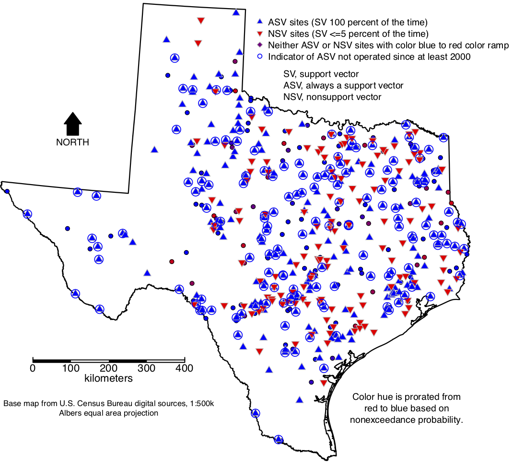

# README (./percSVexp/examapp/README.md)

#### Author:           William H. Asquith
#### Point of contact: William H. Asquith (wasquith@usgs.gov)
#### Date:             September, 2019

***

# INTRODUCTION

This directory is designed to document source code used in the **Example Application** in an draft academic paper (Asquith, 2019). The script `examapp.R` performs the example application. The script requires the external _R_ packages **dataRetrieval**, **kernlab**, **sp**, **rgdal**, **GISTools**, and **feather**. These can be found on the Comprehensive R Archive Network (CRAN) (https://cran.r-project.org). The script is technically demanding and to be seen by users as a recipe of sorts for some research ideas on part of the author.

The `examapp.R` is to be run with the current working directory in _R_ set to `./examapp/`. The directory and script names are to mean "example application."  The script does not need the contents of the `./gwanalog/` directory in this source code archive and vice versa.

## Preamble and Other Setup

The script requires some input data. The text files of watershed properties and annual peak-streamflow frequency values for many hundreds of U.S. Geological Survey (USGS) streamflow-gaging stations (streamgages) in and near Texas are provided in the `./data/` subdirectory. The files are `Appendix1_638wtrshdchr.txt` and `Appendix1_677trimmedQTs.txt` and are downloads accompanying Asquith and Roussel (2009). A spatial data set of United States state boundaries are contained in the Esri ArcGIS shapefile layer `cb_2017_us_state_500k.shp` that resides in `./cb_2017_us_state_500k/` (U.S. Census Bureau, 2019).

The script needs to "know" which streamgages appear active or not. This is determined by the water years of the annual peak streamflow data. The script uses a list of streamgage identification numbers and goes to the Internet and retrieves the period of record data from the date the script is run. Because Internet connection stability can influence behavior, the script caches the table of peaks in the .feather file format inside a directory `./pkrda/`. If this directory does not exist, it creates it. The script is desired to work with this cache so reaching out to the Internet each time is not needed. The cache is designed ultimately to be stored in a `.zip` format of the `./pkrda/` directory and inflate this archive on-the-fly. If the user wants to start with a clean slate, just delete the `pkrda.zip` file and the cache will be reborn when the script is run again.

The script defines two functions: `insertWaterYear()` and `myreadNWISpeak()`. The first adds a water year to data tables of USGS peak streamflows that will be pulled through the Internet from the USGS National Water Information System (U.S. Geological Survey, 2019). This means that the script at one point expects a live Internet connection. The second provides an abstraction layer the the **dataRetrieval** package that pulls USGS peak streamflow data by the `readNWISpeak()` function. The `myreadNWISpeak()` function provides a mechansim for caching the peak streamflow data tables (in a `.feather` format by the **feather** package) in a directory that is created or inflated on-the-fly. This caching permits the reuse of the `examapp.R` script without having to retrieve the USGS data from the Internet each time the script is tested.

The script defines spatial coordinate reference systems `LATLONG` and `ALBEA` for project of latitude and longitude data into Albers Equal area projection for purposes of rendering and map `fig10_svmtexasmap.pdf` that is the primary output of the script. This map along with another figure (`fig09_svmtexaspp.pdf`) will be saved up and down a relative path (see the `./draftfigures/` directory of this source code archive).

The script uses (variable `WC`) the contributing drainage area, main-channel slope, and mean annual precipitation from the `Appendix1_638wtrshdchr.txt` data file. The script also uses  (variable `QT`) the 10-year peak streamflow (10-year average recurrence interval, 0.1 annual exceedance probability) (`trimQ10`) from the `Appendix1_677trimmedQTs.txt` data file. It is important that these data files are read in using the `colClasses="character"` because the USGS streamgage identification numbers need to be strings to retain their leading zeros. The script merges these two data sets into the variable `DB` (database). As a note, two streamgages are removed `08098203` and `08086300` and reasons are documented in the code. There are 636 records (streamgages in `DB`). Finally, logarithmic transformation of the 10-year peak streamflow and the three watershed properties is made.

The streamgage latitude and longitude are acquired from the Internet using the `readNWISsite()` from the **dataRetrieval** package and stored in the `SF` (site file) variable. There are some duplicates because of multiple agencies in the site file, and these are removed. The streamgage locations are projected into Albers Equal area coordinates (northing and easting in meters) with the 10-year and three watershed properties to form a `SpatialPointsDataFrame` using functions of the **sp** package. Finally, only streamgages in Texas (`STATE == 48`) are retained for purposes of the example application documented in the script. There are 536 streamgages (`length(SF$STATION)`).

Summary statistics are presented, notice the retransformations, by the following code with verbatim (October 6, 2019) results.
```{r}
  message("Summary of Overall Network Contributing Drainage Areas in km^2")
  print(10^summary(SF$CDA)*2.589988)
       Min.   1st Qu.    Median      Mean   3rd Qu.      Max.
      0.259    14.892   297.837   168.728  1474.340 24161.998

  message("Summary of Overall Network Main-Channel Slopes, dimensionless")
  print(10^summary(SF$MCS))
      Min.  1st Qu.   Median     Mean  3rd Qu.     Max.
  0.000230 0.001440 0.002535 0.002856 0.005700 0.042790

  message("Summary of Overall Network Mean Annual Precipitation in mm")
  print(10^summary(SF$MAP)*25.4)
     Min. 1st Qu.  Median    Mean 3rd Qu.    Max.
    203.2   596.9   800.1   761.4  1019.2  1447.8
```

## Simulations to Study Support Vector Percentages

The simulations to study support vector percentages being with the loop the begins with the `for(j in 1:nsim)`. The idea here is to loop `nsim=20` times across a leave-one-streamgage-out pass on the support vector machine (SVM) that is defined by
```{r}
  SVM <- kernlab::ksvm(SF$Q10[-i]~SF$CDA[-i]+SF$MCS[-i]+SF$MAP[-i]+SF$X[-i]+SF$Y[-i])
```
The `set.seed()` on the pseudo-random number generator ahead of the SVM call is set using the index of the loop number. For example, the user will see a message to the console of `simulation chuck: 1 with set.seed(1)`. The SVM shown above is for the 10-year peak streamflow (`Q10`) as a "function" of contributing drainage area (`CDA`), main-channels slope (`MCS`), mean annual precipitation (`MAP`), easting coordinate (`X`), and northing coordinate (`Y`). The coordinates are in kilometers and the others are logarithmic. Through the loop and the leave-one-out scheme, some `536*20 == 10720` SVMs are involved.

After the loop completes, the `aggregate()` function and a few other steps are used to count the number of time each streamgage is a support vector in the SVM. This ends with the `svm$svm_ratio` being computed as the fraction of the total number of "passes" by the simulation loop and the leave-one-streamgage-out loop: `svm$svm_count/(nsim*(length(SF$Q10)-1))`. One hundred times this ratio would be the "support vector percentage." Lastly, the loop that begins with `for(site in SF$STATION)` bends the support vector counts (`svm_count`) and the ratio (`svm_ratio`) into the site file (`SF`) data frame.

Several "facts" about the simulation run are then reported to the console (September 27, 2019):
```{r}
  message("Percent of streamgages <= 5 percent of time support vectors = ",
             pct_less_than_five," percent")
    Percent of streamgages <= 5 percent of time support vectors = 25 percent

  message("Number of streamgages <=5 percent of time support vectors = ",
             less_than_five)
    Number of streamgages <=5 percent of time support vectors = 134

  message("Number of streamgages 100 percent of time support vectors = ",
             always_hundred_percent)
    Number of streamgages 100 percent of time support vectors = 283
```

The script then constructs the following figure:

* Figure `fig08_svmtexaspp.pdf` --- This figure depicts the distribution of the support vector percentages of the streamgages in Texas based on leave-one-out SVM operation with `nsim` simulations of leave-out-out. The figure (September 27, 2019) is shown below:


The script then returns to the **dataRetrieval** package to acquire, unless already cached, annual peak streamflow data. The data tables will be stored in the `./pkrda/` directory or the `./pkrda.zip` zipped archive. Interest is not actually on the peak streamflow values for this script and example application but in whether a given streamgage is "active" in contrast to "discontinued." The script uses a definition of any streamgage having its last year in the 21st century as "modern." In particular, the `needed_badly <- needed_greatly[last_year < 2000]` line distinguishes the streamgages by those that are support vectors all the time as `needed_greatly` but have not operated in 20 years or so as ``needed_badly`.

The script then constructs the following figure:

* Figure `fig09_svmtexasmap.pdf` --- Locations of streamgages in Texas from Asquith and Roussel (2009) used to create SVMs for estimation of 10-year peak streamflow using watershed properties of contributing drainage area, main-channel slope, mean annual precipitation, and spatial coordinates. The figure (October 6, 2019) is shown below:




The script then completes with the reporting of summary statistics in regards to the watershed properties of the streamgages that are needed badly so that a comparison to the summary statistics of the greater network can be made. The interest is in what generalized regions of watershed parameter space are represented by the badly needed sites relative to the network. For example, the results seems to indicate that the sites are commonly on smaller watersheds relative to the greater network. Far more details and interpretations are documented in Asquith (2019). Only the drainage area comparison (October 6, 2019) is shown:
```{r}
  message("Summary of Overall Network Contributing Drainage Areas in km^2")
  print(10^summary(SF$CDA)*2.589988)
       Min.   1st Qu.    Median      Mean   3rd Qu.      Max.
      0.259    14.892   297.837   168.728  1474.340 24161.998

  message("Summary of ASV Contributing Drainage Areas in km^2")
  print(10^summary(JK$CDA)*2.589988)
       Min.   1st Qu.    Median      Mean   3rd Qu.      Max.
      0.337     3.250    25.017    45.954   544.653 22172.887
```


# SESSION INFO (Sun Oct  6 10:20:51 2019)
```{r}
  R version 3.6.1 (2019-07-05)
  Platform: x86_64-apple-darwin15.6.0 (64-bit)
  Running under: macOS High Sierra 10.13.6

  Matrix products: default
  BLAS: /System/Library/Frameworks/Accelerate.framework/Versions/A/Frameworks/
                                   vecLib.framework/Versions/A/libBLAS.dylib
  LAPACK: /Library/Frameworks/R.framework/Versions/3.6/Resources/lib/libRlapack.dylib

  locale:
  [1] en_US.UTF-8/en_US.UTF-8/en_US.UTF-8/C/en_US.UTF-8/en_US.UTF-8

  attached base packages:
  [1] stats     graphics  grDevices utils     datasets  methods   base     

  other attached packages:
   [1] feather_0.3.5       GISTools_0.7-4      rgeos_0.5-1        
   [4] MASS_7.3-51.4       RColorBrewer_1.1-2  maptools_0.9-5     
   [7] rgdal_1.4-4         sp_1.3-1            kernlab_0.9-27     
  [10] dataRetrieval_2.7.5

 loaded via a namespace (and not attached):
   [1] Rcpp_1.0.2      rstudioapi_0.10 xml2_1.2.2      hms_0.5.1      
   [5] lattice_0.20-38 R6_2.4.0        lmomco_2.3.2    rlang_0.4.0    
   [9] httr_1.4.1      Lmoments_1.3-1  tools_3.6.1     grid_3.6.1     
  [13] goftest_1.1-1   tibble_2.1.3    crayon_1.3.4    readr_1.3.1    
  [17] vctrs_0.2.0     curl_4.2        zeallot_0.1.0   compiler_3.6.1 
  [21] pillar_1.4.2    backports_1.1.4 foreign_0.8-71  pkgconfig_2.0.3
```

# REFERENCES

Asquith, W.H., 2019, Assessing Site Importance using Support Vectors for Hydrometeorologic Network Analyses: in reconciliation review with Journal of Hydrology. [William H. Asquith, 0000-0002-7400-1861; USGS Information Product Data System (IPDS) no. IP-104552 (internal agency tracking)]

Asquith, W.H., Roussel, M.C., 2009, Regression equations for estimation of annual peak-streamflow frequency for undeveloped watersheds in Texas using an L-moment-based, PRESS-minimized, residual-adjusted approach: U.S. Geological Survey Scientific Investigations Report 2009-5087, 48 p. https://pubs.usgs.gov/sir/2009/5087/.

U.S. Census Bureau, 2019, Shape file `cb_2017_us_state_500k`, accessed on January 22, 2019, at https://www.census.gov/geo/maps-data/data/cbf/cbf_state.html
[Currently (October, 06, 2019) a 2018 version resides at https://www2.census.gov/geo/tiger/GENZ2018/shp/cb_2018_us_state_500k.zip through the parent link https://www.census.gov/geographies/mapping-files/time-series/geo/carto-boundary-file.html]

U.S. Geological Survey, 2019, USGS water data for the Nation: U.S. Geological Survey National Water Information System database, accessed August 9, 2019, at https://doi.org/10.5066/F7P55KJN.
